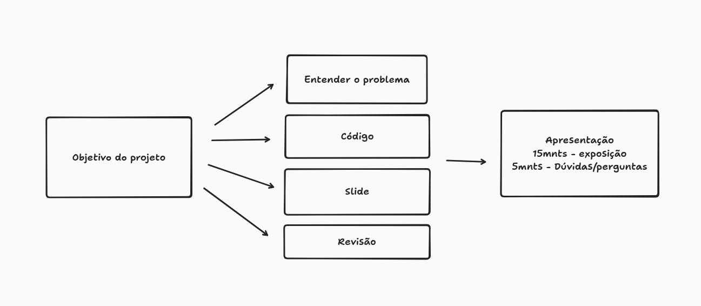

# 7SI-IA

### **Tema**:
    Seleção de equipes

### **Autores:**  
- Thiago 
- Bryan

---

### **1. Objetivo**  
Este trabalho tem como objetivo consolidar os principais conceitos estudados na disciplina ao longo das primeiras aulas. A dupla ou trio deverá escolher um problema real, modelá-lo como um problema de IA e resolvê-lo aplicando de forma integrada, as quatro técnicas vistas em sala:  

    • Modelagem como Espaço de Estados  

    • Busca em Largura (BFS) ou Busca em Profundidade (DFS)  

    • Heurística para guiar ou avaliar soluções  

    • Algoritmo Genético completo (representação, fitness, seleção, crossover e mutação) A ideia não é usar cada técnica de forma isolada, mas mostrar como elas se conectam para atacar um mesmo problema de ângulos diferentes.

---

### **2. O que deve ser entregue**  
#### **2.1 Código Python**  

Um único arquivo .py (ou notebook .ipynb) contendo:  

    • A modelagem do problema como espaço de estados (estados, operadores, estado  
    inicial e estado objetivo)  

    • Implementação de BFS ou DFS aplicada ao problema  

    • Uma heurística definida e justificada  

    • Um Algoritmo Genético completo com: representação do cromossomo, função fitness,  
    seleção, crossover e mutação  

    • Comentários explicando cada parte do código, como fizemos em sala  
    O código precisa rodar sem erros. Certifiquem-se de testar antes da entrega.

#### **2.2 Apresentação de Slides**  

Entre 8 e 10 slides cobrindo:  

1. O problema escolhido e por que é um problema de IA  

2. Como modelaram o espaço de estados  

3. Como a busca (BFS ou DFS) foi aplicada e qual resultado ela encontrou  

4. Qual heurística foi usada e como ela avalia as soluções  

5. Como o Algoritmo Genético foi configurado (cromossomo, fitness, parâmetros)  

6. Comparação de resultados: busca vs. AG, qual foi melhor? Por quê?  

7. O que aprenderam e o que mudaria se tivessem mais tempo Será apresentado ao vivo. Cada apresentação terá 20 minutos, sendo 15 minutos de exposição e 5 minutos para perguntas e/ou comentários do professor.

**Descrição do problema**   

Montar um time de projeto com N pessoas disponíveis, cada uma com habilidades e custos diferentes, dentro de um orçamento

**Como encaixa na ementa**

- BFS para explorar combinações;   

- heurística de cobertura de habilidades;   

- AG para maximizar performance por custo

---

# Resolução

...

---

 @2026 🚀 
